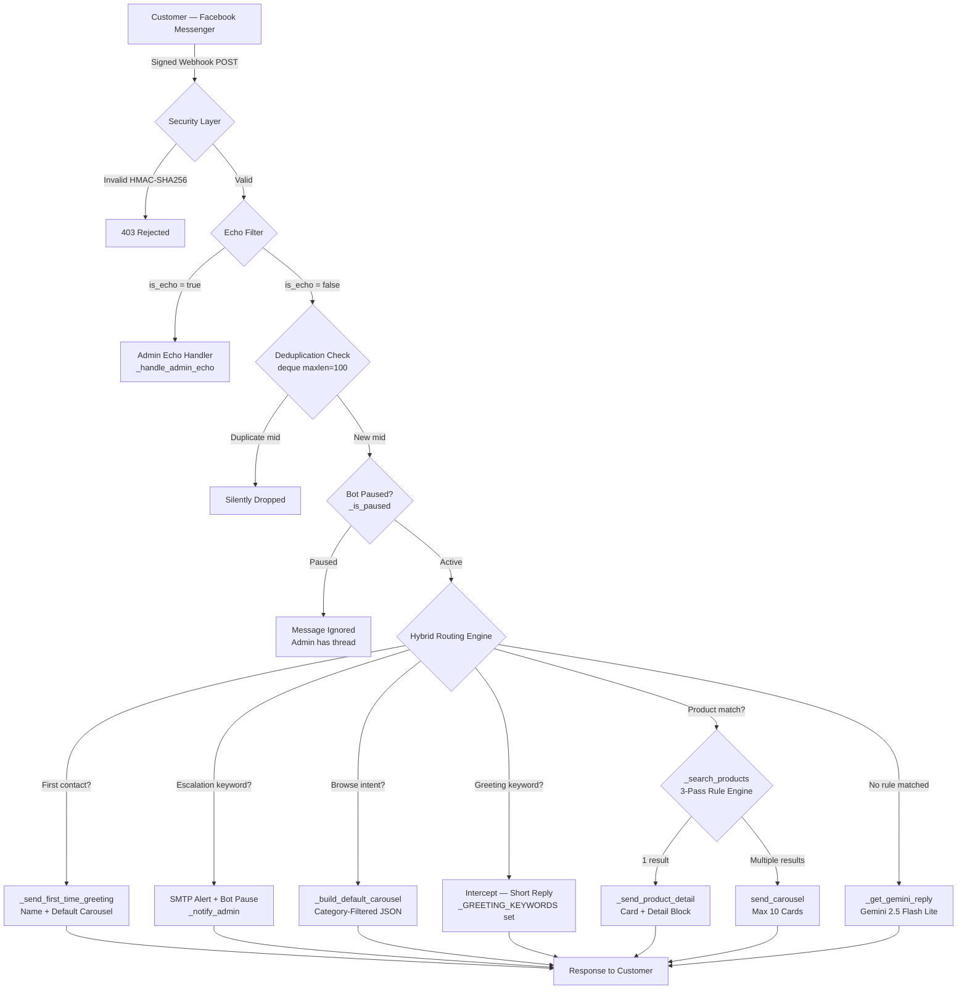

<div align="center">

# Hybrid AI Messenger Chatbot
### *Production-Grade Conversational Commerce Platform for Facebook Messenger*

[](https://python.org)
[](https://flask.palletsprojects.com)
[](https://ai.google.dev)
[](https://render.com)
[](https://developers.facebook.com)
[](https://anthropic.com)

<br>

> **Starring Sofia** — a hybrid AI orchestration engine that sits between customers and a product catalog, resolving business queries through deterministic rule-based routing while leveraging Gemini AI fallback for natural language conversations.

<br>

[Executive Summary](#executive-summary) &nbsp;·&nbsp; [Architecture](#system-architecture) &nbsp;·&nbsp; [AI Workflow](#ai-augmented-development-workflow) &nbsp;·&nbsp; [Architectural Pillars](#architectural-pillars) &nbsp;·&nbsp; [Engineering Challenges](#engineering-challenges) &nbsp;·&nbsp; [Local Setup](#local-development) &nbsp;·&nbsp; [Deployment](#deployment-on-render)

---

</div>

<br>

## Executive Summary

Sofia was engineered to solve a real production problem: most AI-powered shop bots hallucinate product data. They invent prices. They fabricate stock availability. They are unreliable at the exact moment accuracy matters most.

The architecture addresses this with a **strict separation of concerns**. A deterministic rule engine has exclusive ownership of all product data — prices, SKUs, availability. A probabilistic AI layer (Gemini 2.5 Flash Lite) handles everything else: conversation, sizing questions, shipping queries, general brand interaction. The two layers never overlap. The result is a system with the accuracy of a database and the fluency of a language model.

**Deployed on Render. Integrated with Meta Graph API v22. Built and debugged with an AI-augmented development workflow using Cursor, Claude Opus, and Gemini 2.5 Flash Lite.**

<br>

---

## System Architecture



<br>

---

## AI-Augmented Development Workflow

This project was built using a **multi-model AI orchestration workflow** — a deliberate engineering choice that reduced debugging time, improved code quality, and surfaced architectural decisions earlier in the development cycle.

### Tool Allocation by Task

| Task Type | AI Tool Used | Rationale |
|:---|:---|:---|
| System architecture design | **Claude Opus** | Long-context reasoning for multi-component dependency analysis |
| Core engine development | **Gemini 2.5 Flash Lite** | Rapid iteration on routing logic and prompt tuning |
| Gunicorn deployment debugging | **Claude Opus** | Root-cause analysis of worker process isolation behavior |
| HMAC security implementation | **Claude Opus** | Formal verification reasoning for timing-oracle threat model |
| Prompt engineering (Sofia persona) | **Gemini 2.5 Flash Lite** | In-domain testing of Taglish response quality |
| Code review and dedup logic | **Claude Opus** | Systematic audit for race conditions in concurrent sessions |
| IDE Integration | **Cursor** | AI-native code navigation and inline refactoring |

### Key Resolution: Gunicorn Worker Synchronization

The most significant deployment issue encountered was a **silent cache starvation bug** on Render. The product cache was consistently returning empty on production despite successful local tests.

**Root Cause (identified via AI-augmented debugging):**
Flask's conventional `if __name__ == "__main__"` startup guard is never executed by Gunicorn — Gunicorn imports the module directly. All initialization logic inside that guard (`_validate_env()`, `_startup()`, `_refresh_cache()`) was silently skipped. The bot started with an empty cache and never recovered within the first request window.

**Resolution:**
```python
# BEFORE — Gunicorn never executes this block
if __name__ == "__main__":
    _validate_env()
    _startup()          # _refresh_cache() called here — NEVER RUNS under Gunicorn
    app.run(...)

# AFTER — Module-level triggers, executed on import by any WSGI server
_validate_env()
_startup()              # Cache populated before first request arrives

if __name__ == "__main__":
    app.run(host="0.0.0.0", port=int(os.getenv("PORT", "5000")), debug=False)
```

**Confirmed in production logs:**
```
Environment validated.
Gemini configured (model: gemini-2.5-flash-lite).
Scheduler started — cache refresh every 60 min.
Cache refreshed — 60 products loaded.          ← Proof of fix
```

<br>

---

## Architectural Pillars

### 1. Hybrid Logic Engine

The core design principle: **deterministic logic owns all data, probabilistic AI owns all conversation.** These domains are strictly non-overlapping.

```
Incoming Message
      │
      ├── Contains product keyword / SKU / price filter?
      │         └── Rule Engine → JSON cache → exact data returned
      │
      └── General conversation / intent unclear?
                └── Gemini 2.5 Flash Lite → natural language response
                    (system prompt explicitly forbids product data statements)
```

The Gemini system instruction includes a hard constraint:
> *"NEVER state specific product prices, SKUs, or stock levels yourself. All product data is served by the rule engine, not by you."*

This architectural boundary is the reason Sofia cannot hallucinate product information — the model is structurally prevented from accessing that domain.

### 2. State-Aware UX Engineering

**Contextual Session Management** is handled via a per-PSID session dictionary with three tracked fields: `greeted`, `paused`, and `email_ts`. All mutations are protected by a single `threading.Lock`.

The `_GREETING_KEYWORDS` interceptor demonstrates the most nuanced state decision in the routing engine:

```python
_GREETING_KEYWORDS = frozenset({
    "hi", "hello", "hey", "kumusta", "kamusta", "musta",
    "good morning", "good afternoon", "good evening",
    "magandang umaga", "magandang hapon", "magandang gabi",
    "sup", "yo",
})
```

**Routing logic by session state:**

| User State | Message | Route | Outcome |
|:---|:---|:---|:---|
| `greeted=False` | Any (first message) | `_is_first_time` → True | Full onboarding: name greeting + carousel |
| `greeted=False` | Click Get Started | Postback → `_is_first_time` → True | Full onboarding via postback path |
| `greeted=True` | `"hi"` | `_GREETING_KEYWORDS` intercept | Short reply + catalog — Gemini not called |
| `greeted=True` | Click Get Started again | Postback → `_is_first_time` → False | Catalog-only quick access |
| `paused=True` | Any message | Paused guard | Silently ignored — admin has thread |

**Zero double-greetings across all entry paths.** Verified by tracing all five user journey scenarios.

### 3. Resiliency and Scalability

**Message Deduplication via Rolling Deque**

Facebook's webhook delivery guarantee is "at least once" — not "exactly once." Under load, a Gemini API call exceeding Facebook's timeout threshold triggers a retry, resulting in duplicate processing.

```python
_seen_message_ids: deque[str] = deque(maxlen=100)

def _is_duplicate(mid: str) -> bool:
    with _state_lock:
        if mid in _seen_message_ids:
            return True          # Already processed — drop
        _seen_message_ids.append(mid)
        return False             # New message — process
```

`deque(maxlen=100)` provides O(1) append with automatic eviction of the oldest ID. At production scale, this would migrate to a Redis SET with TTL — the interface is identical.

**HMAC-SHA256 Webhook Signature Verification**

Every POST to `/webhook` is verified before any application logic runs:

```python
computed = hmac.new(FB_APP_SECRET.encode(), raw_body, hashlib.sha256).hexdigest()
return hmac.compare_digest(computed, header[7:])   # Constant-time — timing-oracle safe
```

`hmac.compare_digest` is used instead of `==` to prevent timing-oracle attacks where an attacker measures comparison duration to brute-force the secret byte-by-byte.

### 4. Dynamic Carousel Rendering

Product cards are assembled at runtime from the live JSON cache. Price formatting, stock label mapping, and payload serialization are all handled inline:

```python
# Defensive price parsing — handles both int (450) and legacy string ("₱450") formats
raw_price     = str(p.get("price", 0)).replace("₱", "").replace(",", "").strip()
price_display = f"₱{int(float(raw_price)):,}"

# _stock_label() maps 4 availability states to display strings
stock_label = _stock_label(p.get("availability", ""))
# "In Stock" → "Available" | "Limited Edition" → "Limited Ed."
# "Low Stock" → "Low Stock" | anything else → "Out of Stock"
```

Each carousel element embeds a structured postback payload for the View Details handler:
```json
{ "action": "view_price", "product_id": "ACE-OVT-001" }
```

### 5. SMTP Escalation System

Admin handover is triggered by a `frozenset` of escalation keywords. The notification pipeline is rate-limited via a sliding-window algorithm to prevent Gmail abuse detection:

```python
EMAIL_RATE_LIMIT  = 2    # max 2 emails per user
EMAIL_WINDOW_SECS = 300  # within any 5-minute window

def _allow_email(psid: str) -> bool:
    recent = [t for t in session["email_ts"] if t > now - EMAIL_WINDOW_SECS]
    if len(recent) >= EMAIL_RATE_LIMIT:
        return False             # Throttled — suppressed silently
    recent.append(now)
    session["email_ts"] = recent
    return True
```

On trigger: customer receives a Taglish apology, admin receives a structured alert (name, PSID, message, timestamp), and the bot sets `paused=True` for that thread. Admin resumes by typing `bot` or `sofia` in the Page inbox.

<br>

---

## Feature Showcase

| Feature | Technical Implementation | Business Outcome |
|:---|:---|:---|
| **Dynamic Carousel Rendering** | Runtime JSON assembly, defensive price parsing, `_stock_label()` mapping | Accurate product cards with live stock status on every query |
| **Hybrid Logic Routing** | 6-step deterministic pipeline before probabilistic fallback | Zero price hallucination, sub-2s response on rule matches |
| **Contextual Session Management** | Per-PSID `threading.Lock`-protected state dict | No duplicate greetings, correct admin/bot thread ownership |
| **SMTP Escalation** | Sliding-window rate limiter, smtplib STARTTLS, bot auto-pause | Admin notified only for real escalations, never spammed |
| **Production Bootstrapping** | Module-level `_validate_env()` + `_startup()` triggers | Cache populated at Gunicorn import — zero cold-start latency |
| **Webhook Security** | HMAC-SHA256 + `hmac.compare_digest` + 1MB body cap | Forged payloads rejected before application code runs |
| **Message Deduplication** | `deque(maxlen=100)` rolling ID window | Facebook retry floods silently dropped — no double-replies |
| **SSRF Prevention** | Regex pattern validation on `GITHUB_PRODUCTS_URL` at boot | Internal network requests blocked if env var is misconfigured |

<br>

---

## Tech Stack

| Layer | Technology | Role |
|:---|:---|:---|
| **Backend / Middleware** | Python 3.11+ / Flask 3.x | Webhook server and routing engine |
| **AI Core** | Google Gemini 2.5 Flash Lite | Conversational fallback with persona enforcement |
| **Messenger API** | Meta Graph API v22 | Message delivery, Generic Templates, postbacks |
| **Product Data** | GitHub-hosted JSON | Live catalog with 60-min auto-refresh via APScheduler |
| **Email** | smtplib + Gmail SMTP + STARTTLS | Rate-limited admin escalation alerts |
| **Security** | HMAC-SHA256 + `hmac.compare_digest` | Signed webhook verification |
| **Secrets** | Render Secret Files (`/etc/secrets/`) | Zero-exposure credential storage |
| **IDE / Tooling** | Cursor + Claude Opus + GitHub | AI-augmented development and architectural review |
| **Deployment** | Render (CI/CD on `git push main`) | Auto-deploy production hosting |
| **Local Dev** | ngrok + python-dotenv | HTTPS tunnel and local environment isolation |
| **Process Manager** | Gunicorn (`--workers 1 --threads 4`) | Single-worker threading to preserve in-memory session state |

<br>

---

## Project Structure

```
Hybrid-AI-Messenger-Bot/
├── messenger_bot_test.py   # Core middleware — 7 sections, fully documented
│                           # Sections: Security · Memory · Data · API Handlers
│                           #           Routing Engine · Flask Routes · Startup
├── products.json           # Live product catalog — edit to update Sofia instantly
├── requirements.txt        # Pinned dependencies
├── Procfile                # gunicorn --workers 1 --threads 4 messenger_bot_test:app
├── runtime.txt             # python-3.11.9
├── privacy.html            # Meta platform policy compliance
├── .gitignore              # .env and secret files excluded
└── README.md               # This document
```

<br>

---

## Engineering Challenges

### Challenge 1 — Silent Cache Starvation on Render
**Symptom:** Bot deployed successfully. All environment variables confirmed present. Product cache consistently empty on first request. Keywords returned zero matches. Cache log line never appeared.

**Diagnosis process:** Confirmed locally via ngrok — cache loaded correctly. Isolated to deployment environment. Identified that Gunicorn worker import behavior bypasses `if __name__ == "__main__"`. Verified with Claude Opus via architectural trace of Python module import vs direct execution.

**Resolution:** Moved `_validate_env()` and `_startup()` to module level. Cache now loads during Gunicorn's worker initialization phase — before any HTTP request is processed.

**Time to resolution with AI-augmented debugging:** ~10 minutes from symptom to confirmed fix in Render logs.

---

### Challenge 2 — Double-Greeting Across Entry Paths
**Symptom:** Users who clicked the Get Started button and then typed "hi" received two greetings. Sofia's Gemini fallback was generating its own introduction despite the bot already having welcomed the user.

**Diagnosis process:** Traced all entry paths. Confirmed `greeted=True` was being set correctly by the Get Started postback handler. Identified that "hi" was falling through the rule pipeline to Gemini, which has no awareness of session state.

**Resolution:** Implemented `_GREETING_KEYWORDS` interceptor at Step 4 of the routing pipeline — after catalog browse detection, before product search. Any greeting word sent by an already-greeted user returns a short acknowledgement and the catalog. Gemini is never invoked for these messages.

**Verified across 5 user journey scenarios** with no double-greeting possible in any path.

---

### Challenge 3 — Wrong Availability Labels for 24 Products
**Symptom:** Carousel cards displayed "Out of Stock" for Limited Edition and Low Stock products. 24 of 60 products showed incorrect status.

**Root Cause:** Original code handled only two states (`"In Stock"` / else `"Out of Stock"`). The JSON schema defined four: `"In Stock"`, `"Limited Edition"`, `"Low Stock"`, `"Out of Stock"`. The mismatch was silent — no errors raised, wrong labels rendered.

**Resolution:** Replaced inline ternary with a `_stock_label()` helper using an explicit dict lookup:
```python
def _stock_label(availability: str) -> str:
    labels = {
        "In Stock":        "Available",
        "Limited Edition": "Limited Ed.",
        "Low Stock":       "Low Stock",
        "Out of Stock":    "Out of Stock",
    }
    return labels.get(str(availability).strip(), "Out of Stock")
```
Applied consistently across `send_carousel()` and `_send_product_detail()`.

<br>

---

## Local Development

```bash
git clone https://github.com/Lawrenzie09/Hybrid-AI-Messenger-Bot.git
cd Hybrid-AI-Messenger-Bot

python -m venv .venv
.venv\Scripts\activate           # Windows
source .venv/bin/activate        # Mac / Linux

pip install -r requirements.txt
pip install python-dotenv        # local dev only
```

Create `.env`:
```env
PAGE_ACCESS_TOKEN=your_value
FB_APP_SECRET=your_value
VERIFY_TOKEN=your_value
GEMINI_API_KEY=your_value
GITHUB_PRODUCTS_URL=https://raw.githubusercontent.com/Lawrenzie09/Hybrid-AI-Messenger-Bot/main/products.json
SENDER_EMAIL=your_gmail@gmail.com
SENDER_PASSWORD=your_app_password
RECEIVER_EMAIL=admin@example.com
HEALTH_TOKEN=any_random_string
```

Add locally only (remove before push):
```python
from dotenv import load_dotenv
load_dotenv()
```

```bash
# Terminal 1
python messenger_bot_test.py

# Terminal 2
ngrok http 5000
```

<br>

---

## Deployment on Render

1. Push to GitHub — Render auto-deploys on `git push main`
2. Add all env vars in Render → Environment tab
3. Add `FB_APP_SECRET` and `PAGE_ACCESS_TOKEN` as Secret Files at `/etc/secrets/`
4. Confirm `Procfile`:
   ```
   web: gunicorn --workers 1 --threads 4 messenger_bot_test:app
   ```

**Note on `--workers 1`:** Multiple workers create separate Python processes with isolated memory. `_user_sessions`, `_seen_message_ids`, and `_products_cache` are all in-memory. Worker 2 would not know a user was already greeted by Worker 1. Single worker + 4 threads provides concurrency without state fragmentation.

<br>

---

## Testing Checklist

| # | Scenario | Input | Expected |
|:---:|:---|:---|:---|
| 1 | First-time greeting via message | `hi` (first ever) | Name greeting + 10-card carousel |
| 2 | First-time greeting via Get Started | Click Get Started | Name greeting + carousel via postback path |
| 3 | Re-greeting blocked | `hi` (second time) | Short reply + catalog — no full greeting |
| 4 | SKU direct lookup | `ACE-OVT-001` | Single card + price + description |
| 5 | Keyword search | `mesh shorts` | Multi-product carousel |
| 6 | Price filter | `hoodie below 1200` | Filtered carousel |
| 7 | Admin handover | `refund` | Taglish apology + SMTP alert + bot pauses |
| 8 | Bot resume | Admin types `bot` | Sofia resumes, customer notified |
| 9 | AI fallback | `ano po sizing niyo?` | Gemini Taglish reply |
| 10 | Security — unsigned request | Forged POST | `403 Forbidden` |

<br>

---

## Contact

<div align="center">

**Open to roles in Junior AI Automation Engineer, Junior AI Automation Specialist, and Junior AI Prompt Engineer.**

Experienced in production Python systems, AI-augmented development workflows, webhook architecture, and deploying real products used by real customers.

<br>

| | |
|:---|:---|
| **Email** | [nlawrenzer@gmail.com](mailto:nlawrenzer@gmail.com) |
| **Live Demo** | [Message Sofia on Messenger](https://m.me/SofiaAIDemo) |
| **GitHub** | [github.com/Lawrenze09](https://github.com/Lawrenze09) |

<br>

**Available for:**

• Junior AI Automation Engineer <br>
• Junior AI Automation Specialist <br>
• Custom Messenger Bot Development <br>
• Junior AI Prompt Engineer

<br>

---

<sub>Sofia: Hybrid AI Sales Middleware &nbsp;·&nbsp; Built by Nazh Lawrenze Romero &nbsp;·&nbsp; Powered by Google Gemini AI &nbsp;·&nbsp; Deployed on Render</sub>

<sub><i>Engineered with Claude Opus · Developed in Cursor · Production-hardened on Render</i></sub>

</div>
